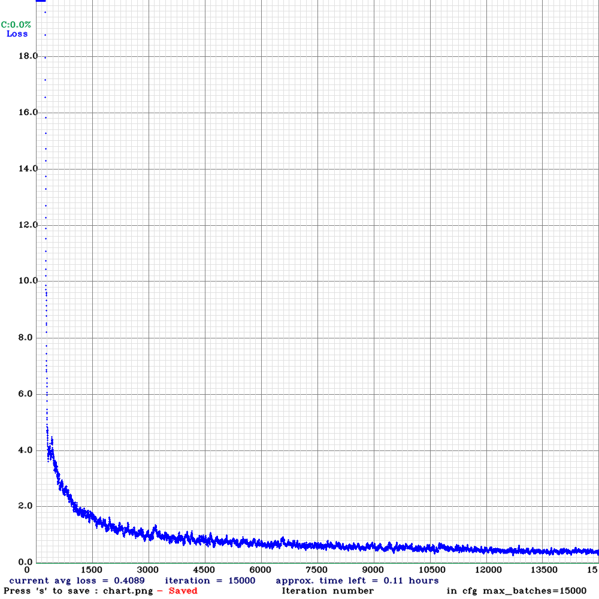
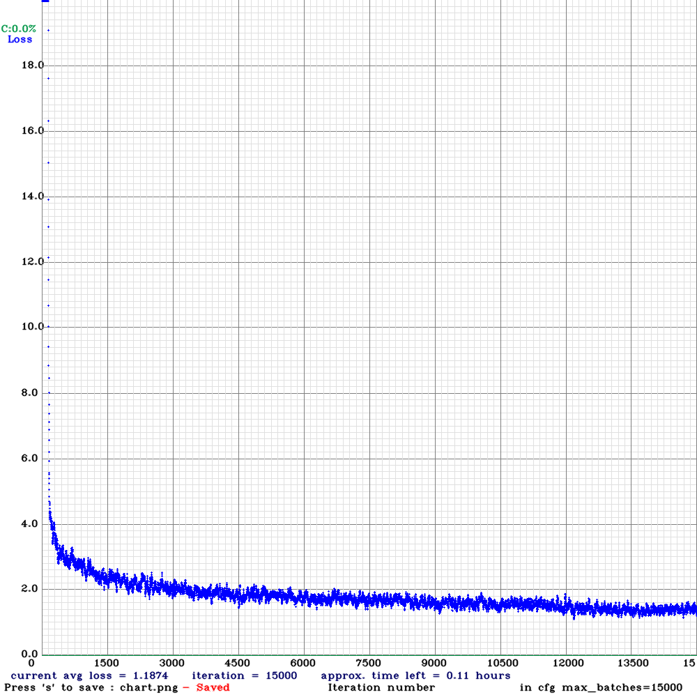
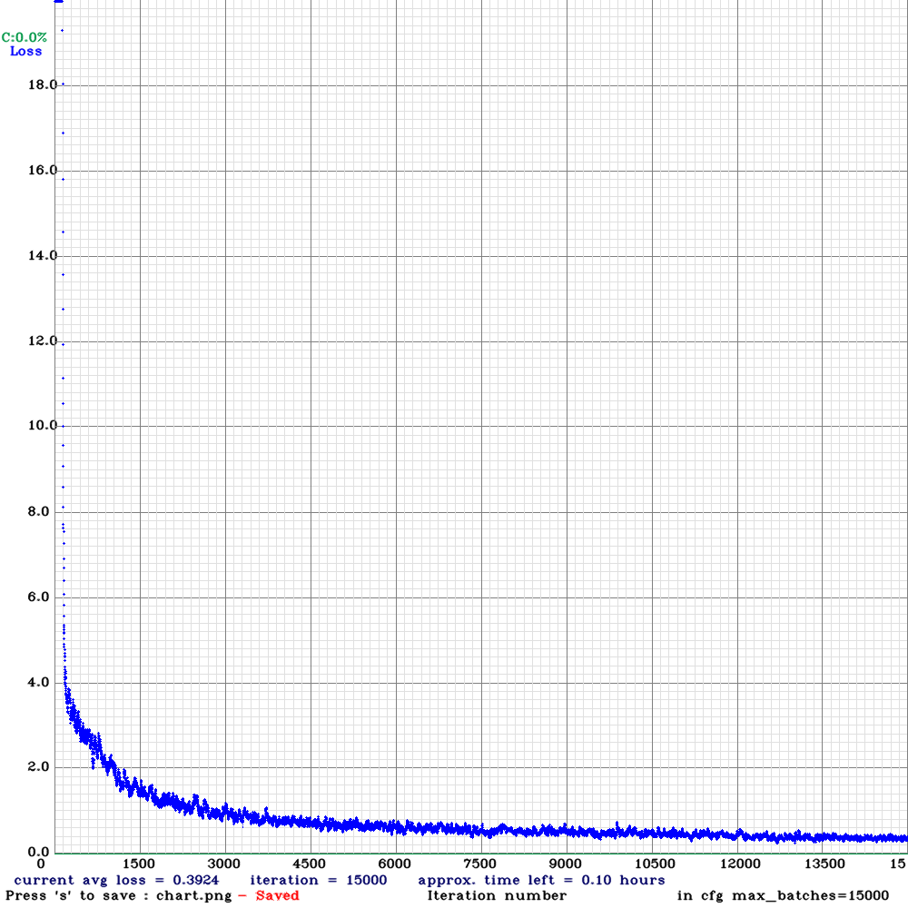
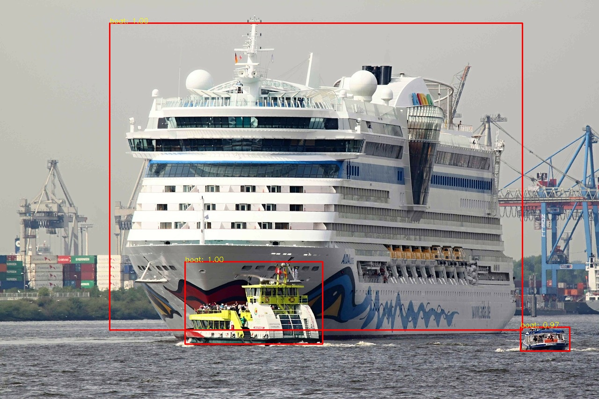

# Computer Vision - Boat Detector

## Introduction

In this project, it was required to perform boat detection from single frames that can be useful in automated analysis of boat traffic in the sea.
Different techniques is used in Computer Vision in order to perform object detection of any kind (e.g., resorting to HOG descriptors combined with Machine Learning algorithm, such SVM, or Bag of Words image classification), however, for this project it has been chosen a Convolutional Neural Network (CNN) in order to deal with the the high variability with which a generic boat can present itself. In particualr the YOLO algorithm has been exploited to perform this task. 
YOLO (You Only Look Once) algorithm employs CNN to detect object in real-time; the CNN is used to predict various class probabilities and bounding box simultaneously. The YOLO object detector has been trained using the darknet open-source neural network framework with a dataset of boats images found from the kaggle platform at the link: https://www.kaggle.com/clorichel/boat-types-recognition/.
All the images have been manually annotated and from the annotation json files obtained it has been extracted the labels in txt format used by the darknet for training. Three approaches have been adopted to modify the images that have fed the darknet neural networks, then, the result it has been tested with the YOLO algorithm on a set of test images.

## Data Annotation

In the kaggle dataset all the images was divided in class depending on the specific boat (e.g., sail boat, ferry boat etc.) but, for the purpose of the project, every boats has been grouped in a single class. In each image a bounding box , defined by the coordinates , has been used to highlight each boat present on the scene.
The images has been annotated using the website https://dataloop.ai/ which return the annotations on a dataset of JSON files, one for each image, containing all the labels information. To parse all the necessary information contained in the JSON files a dedicated class in C++, which makes use of the library json.hpp _https://github.com/nlohmann/json_, named `labeltxt.cpp` & `labeltxt.h`, has been created to convert the annotations provided in a txt files in the format `classNumber x y width height` where the `classNumber` is nothing but the object class mapped to an integer, therefore for the current project specification it will be just , while `x y width height` are the coordinates of the box center, its width and its height, normalized from  to  with respect to the image size.
This process is mainly performed by two functions in the class, specifically: 
```c++
void setJsonPath(std::string path); // Specify the path of the JSON annotation file
```
which load the JSON file, specified by the provided path, and 
```c++
  void extractLabelsCoordinates(      // Extract and convert annotation label and box
    std::string emptyClass = "water", bool wtxt = true,
    bool classify = false, std::string obj = "boat");
```
that firstly checks if there are annotations in the image, or if the images has no label or labeled as without boats, then for each annotation found extract the bounding box coordinates converting them in the correct format and, by default, write the `.txt` file with all the information required.

## Data Preprocessing

As previously mentioned, different processes have been performed on the images that have been used to train the network.
Firstly, in all the case, the image set has been split in a train and validation set with a, default, ratio of .

### Naive Approach

A first attempt is done by training the darknet leaving the images as they are in the original dataset, which consists of a total of 1449 images of different boats, taken in an high variety scenarios from many different point of view. Thanks to this characteristics, the result was considered as a good baseline to evaluate the performance change based on the next approaches adopted.

### Data Augmentation Approach

The neural network used is already configured to do some data augmentation on the training dataset by changing randomly the image, according to the configuration specific given, for instance rotating it of a random angle or changing the hue of the image. In this situation however it has been decided to increase images changes resorting to illumination change, contrast change, equalization of the images histograms (in the RGB color space) and blurring the images with a fixed size Gaussian filter. In addition it has been also performed perspective transformation (https://www.researchgate.net/publication/338184137_Perspective_Transformation_Data_Augmentation_for_Object_Detection) in order to enrich the data augmentation.
The class `dataugmentation.cpp` & `dataugmentation.h` allows to easily perform the steps previously introduced. 
The functions, one for each transformation, are
```c++
  void equalize(cv::Mat& dst, int count = 0);
```
```c++
  void changeContrast(cv::Mat& dst, int count = 0);
```
```c++
  void changeBrightness(cv::Mat& dst, int count = 0);
```
```c++
  void gaussianSmooth(cv::Mat& dst, double sigma = 3, int count = 0);
```
```c++
  void changePerspective(cv::Mat& dst, float sigma = 0.5, int count = 0);
```
These functions return the edited images, starting from the original provided by the function
```c++
  void allignAnnotation(std::vector<std::vector<cv::Point2f>>& boxCorners);
```
For saving the annotations automatically in the new images it is also required to specify the bounding box coordinates and the classes in the image, corresponding to the object in the specified boxes. The variable `save` is used to determine whether to generate the text annotations file or not. 
For this approach a particular emphasis has been given to the perspective transformation. Its mechanism is divided into two part, firstly, new images with different viewpoints were created resorting to the perspective transformation, then, annotation alignment is used to generate corresponding annotation files.
The perspective transformation itself is


where  is the source coordinates of the input pixel and  is the coordinates of the pixel in the output image. The perspective transformation matrix, which can be considered as a planar homography, is found starting from the four vertices of the image 


where  is the width of the image and  is the height, and the four random points 


with


The choice of the four points taken in this way ensure that any three points in  and  are non-collinear. The hyperparameter  is the perspective parameter; the grater of value , the more obvious the perspective transformation.
In the perspective transformation function the 8 points just introduced are chosen randomly in the interval previously defined.
In the new image also the corresponding bounding box is modified becoming, usually, trapezoidal. Unfortunately CNN can not deal with boxes that are not rectangular, therefore, an auxiliary function is created in order to align the corresponding bounding box.
In particular, assuming  as the four vertex of the transformed bounding box, the new coordinates are chosen as follows:


This method allows to automatically generate trainable annotated images, without additional manual labeling.
Finally, if the variable `save` is set to `true`, for all the transformation the private function 
```c++
  void saveAndWritetxt(
    cv::Mat img, std::string imgPath, std::vector<int> classNumber,
    std::vector<std::vector<cv::Point2f>> boxCorners,
    std::string augType, int count);
```
will generate the txt file with the corresponding bounding boxes annotations.

### Gradient Approach

Gradient often plays a key role in Computer Vision for object detection or pattern recognition based on the object appearance. A perfect example is the Histogram of Oriented Gradient (HOG) descriptor, used for image classification. The boats, despite the high variety with which they show, have some characteristic shape that might be exploited resorting to the gradient of the image. In particular it has been chosen to simply use the magnitude of the gradient in both the  and  directions. It has been decided to not filter the image (as for instance is done for the Canny edges) since also noise can be learned, and, moreover, the thickness of the edges might carry important information. This transformation can also be combined with data augmentation. However, the result did not bring any improvement, and therefore this approach has been discarded.

## Darknet Training

The Neural Network used is the [Alexey's darknet](https://github.com/AlexeyAB/darknet/) which is constantly maintained and contains many improvement with respect the official [Darknet repo](https://github.com/pjreddie/darknet), where the last commit was in September 2018.
The network was trained for YOLOv4, using an RTX3090, modifying the configuration file according to the instruction provided by the creator and the task requirements. For all the three approaches the same resolution and the same number of iteration (always greater than the minimum recommended quantity) have been used. Also, the pre-trained files provided in the instruction have been used as starting [weights](https://drive.google.com/open?id=1JKF-bdIklxOOVy-2Cr5qdvjgGpmGfcbp).

## Result
All the three trainings went well, as shown in Figure 1, but unfortunately, due to a CUDA 11.3 bug it was not possible to see also the mean Average Precision. For this reason, the source code has been modified to keep track of the progress every 1000 iterations and then manually evaluate the metrics on the validation set.
|  |  |  |
|:--:|:--:|:--:|
| *Figure 1.a: Naive approach loss* | *Figure 1.b: Data Augmentation approach loss* | *Figure 1.c: Gradient approach* |

According to the results shown in the following table, it has been chosen for the naive approach the weights at 10000 iterations, while for the training performed with gradient and data augmentation in both cases the best choice was the weights at 15000 iterations.
Defined the best weights for every approach they have been tested, with the C++ script `yoloDetector.cpp` created using the YOLO implementation of OpenCV, which has great performance also resorting only on the CPU, without being forced to have a powerful GPU.

|# iteration	|--- 	|naive			|---	|augmented		|---	|gradient		|---	|
|---		|---	|---			|---	|---			|---	|---			|---	|
|---		|---	|average IoU		|mAP	|average IoU		|mAP	|average IoU		|mAP	|
|1000		|---	|47.90%		|68.54%|62.26%			|75.93%|47.42%			|71.14%|
|2000		|---	|55.90%		|78.96%|66.67%			|91.67%|63.78%			|89.18%|
|3000		|---	|61.12%		|77.37%|70.82%			|94.39%|74.13%			|88.78%|
|4000		|---	|60.88%		|74.46%|78.35%			|94.82%|79.91%			|89.49%|
|5000		|---	|67.20%		|73.03%|77.66%			|95.39%|79.77%			|90.62%|
|6000		|---	|66.99%		|75.47%|81.66%			|93.79%|81.19%			|88.85%|
|7000		|---	|67.35%		|74.30%|80.05%			|94.21%|81.58%			|89.57%|
|9000		|---	|69.23%		|73.89%|79.14%			|94.32%|79.53%			|89.11%|
|10000		|---	|69.07%		|75.68%|83.02%			|93.99%|82.64%			|89.40%|
|11000		|---	|70.25%		|72.95%|77.91%			|94.81%|82.63%			|88.52%|
|12000		|---	|68.28%		|74.72%|82.01%			|94.69%|84.00%			|88.59%|
|13000		|---	|69.39%		|75.35%|85.09%			|94.91%|86.13%			|88.62%|
|14000		|---	|70.32%		|74.87%|84.92%			|95.07%|86.51%			|88.65%|
|15000		|---	|70.73%		|73.67%|86.09%			|94.75%|86.64%			|88.65%|

|10k iteration		|---	|15k iteration		|---	|15k iteration		|--- 	|
|---			|---	|---			|---	|---			|---	|
|IoU on test:		|79.30%|IoU on test:		|85.78%|IoU on test:		|87.60% |
|FP:0 - FN:0		|---|FP:0 - FN:0		|---|FP:0 - FN:0		|---	|
|IoU on test:		|78.14%|IoU on test:		|84.51%|IoU on test:		|83.09% |
|FP:2 - FN:0		|---|FP:0 - FN:1		|---|FP:1 - FN:2		|---	|

In the tables it is showed the performance of the network using the average Intersection over Union (IoU) metric over all the correct boats found on two test set, the one provided in the project specification, and a test set made of a few images selected from Google Images.
In both the test sets it is clear how the pre-processing positively influence the final result with a good increments of the bounding boxes precision.

### Intersection over Union (IoU)

To calculate the intersection over union the OpenCV the operator  has been used. This operator returns the intersection of two given rectangular.

The lines of code
```c++
    for (size_t i = 0; i < predBoxes.size(); i++) {
      boxInfoTemp.clear();
      bbox boxIoU;
      for (size_t j = 0; j < trueBoxes.size(); j++) {
        // calculating Intersection between true and predicted boxes
        Rect intersect = predBoxes[i] & trueBoxes[j];
        float intersectArea = intersect.width * intersect.height;
        float unionArea = (predBoxes[i].width * predBoxes[i].height)
         + (trueBoxes[j].width * trueBoxes[j].height) - intersectArea;
        float IoU = intersectArea / unionArea;
        setBox(boxIoU, Point(predBoxes[i].x+(predBoxes[i].width/2),
         predBoxes[i].y+(predBoxes[i].height/2)), IoU);
        boxInfoTemp.push_back(boxIoU);
      }
      boxInfo.push_back(boxInfoTemp);
    }
```
create a  matrix (with  predicted boats and  true bounding boxes) storing all the IoU between all the predicted-true boxes.
Once this matrix is created, the dedicated function 
```c++
      bbox maxBox = findMaxIoU(boxInfo);
```
looks for the box intersection with the highest IoU and extracts it, removing also the row and the column from the matrix guaranteeing other "weaker" intersection with that boxes to be discarded.
This process is repeated iteratively until the matrix has elements.

From this matrix of IoU it is also possible to calculate the false negative and false positive prediction counting the zero rows and columns (once performed a suppression of all non maxima IoU).
For all matching bounding boxes a rectangle is displayed in the image and in the terminal it will be indicated the center of each rectangular with the respective Intersection over Union.

## How the code works

The boat detector solution has been divided into two parts, each with a dedicated executable.

#### Preprocess

The first part consists in the data pre-processing where all the transformation previously described is performed according to the approach chosen and the text annotation files is created from the JSON annotations. The change in illumination and contrast, the equalization of the RGB colorspace and the smoothing are always performed if the data augmentation is set true, while for the perspective transformation it is left the freedom to choose how many variation generate, with increasing magnitude intervals at each transformation.

The gradient transformation can be performed both on the original dataset and the augmented dataset.

#### Detection

The second executable is the yolo predictor itself. As a first step it loads the darknet configuration and the weights files. Next, for every images, based on the adopted preprocessing, it can be chosen to run the detection on the original image or on its gradient magnitude. Then it creates a 4D blob that is used to perform the detection. Once done that the labels names are obtained from the configuration files and used in the detection. Finally the obtained result of the detection are passed through to a postprocess step that extract all the boxes higher than a confidence threshold and moreover it performs non maxima suppression to merge all the overlapping boxes.
The the result are displayed in an image where all the bounding boxes remained are drawn with their confidence, as shown in Figure 2.

To conclude, in the terminal, for each box is indicated its center and its IoU, according to the manually annotated ground truth.

|  |
|:--:|
| *Figure 2: Detection result with augmented dataset example* |

**Note**: All the detected images are saved in a subfolder of the test images directories named *result*. The corresponding test images paths are *test_result/google/* and *test_result/kaggle/*.

## How to run

#### Preprocess

The `commandLineParser` of OpencV has been implemented to allow the user to customize the preprocess. The only mandatory step is to place the images in the *data/* directory, with any subfolder path that can be specified from the command line (e.g., `./datasetPreprocessing -t=train/` if the images are in the path *data/train/*).

It is also possible to chose to use a different validation set, or extract it directly from the images provided in the training set. Then it can be chosen to perform the data augmentation or the gradient transformation. Finally, other auxiliary options have been implemented. For any other necessity run `./datasetPreprocessing -h`.

#### Detection

Also in this case the `commandLineParser` of OpencV has been implemented, in particular to allow the specification of the configuration and the weights directories paths, set by default as *cfg/*, where all the necessary files for the Neural network are placed (`.cfg`, `.names`, `.weights`), it is, however, possible to indicates different values for those files.

Another important information is the path of the test images folder which can be specified with the command `-i=path/to/images/`.
Before running the program, the first step is to download the weights for the YOLO detector algorithm from the Google Drive [link](https://drive.google.com/drive/folders/1l9XJYxJBKEy6aWem1EERb68zj5qSdiZU?usp=sharing) and place them in the configuration directory.

Finally, while running, it is possible to define which weights file to use and if the detection has to be done on the gradient magnitude of the image provided. For any other necessity run `./yoloPrediction -h`.

_**Example**_
`./yoloPrediction -i=test\_result/kaggle/`
*The program, in the default cfg/ directory, looks for all the weights files present, and it will perform the detection on the images found in the path ~test_result/kaggle/. On the command line will be asked which of the found weights to use and if it is required to perform the detection on the gradient magnitude of the images.*

**Note**: All the dataset and the configuration file used for this project can be downloaded at this [link](https://drive.google.com/drive/folders/1dldICEytYD90BTJIuEnnUtesmzdZ9Lex?usp=sharing).
